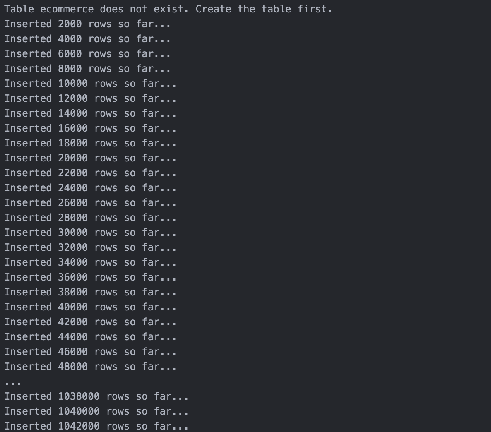

# **Real-Time E-Commerce Analytics Project**

## **Overview**

This project performs **real-time analytics** on an **e-commerce dataset** using technologies like **Kafka, HDFS, Spark, HBase**, and **Flask**. The data pipeline involves data ingestion, cleaning, storage, and visualization through a Flask app with EDA.

---

## **Dataset**

- **Source**: [Kaggle Dataset - E-Commerce](https://www.kaggle.com/datasets/zainanis1/ecommerce-dataset)
- The dataset contains transaction records, including **purchase details, timestamps, credit card info, and location data**.

---

## **Technologies Used**

- **Kafka** - Streaming data ingestion.
- **HDFS** - Distributed storage.
- **Spark** - Data cleaning and transformation.
- **HBase** - NoSQL database for structured storage.
- **Flask** - Web framework for visualization.
- **Python** - Used for processing and scripting.
- **Docker** - Containerized environment for deployment.

---

## **Architecture**

### **Workflow Diagram**

1. **Data Ingestion** - Kafka streams data into HDFS.
2. **Data Cleaning** - Spark processes and fixes the dataset.
3. **Storage** - Cleaned data is saved in HDFS and transferred to HBase.
4. **Visualization** - Flask app connects to HBase and provides insights.

_Insert Architecture Diagram Screenshot Here_

---

## **Steps**

### **1. Data Ingestion with Kafka**

- The raw dataset was streamed to **HDFS** using **Kafka**.
- Kafka Topics were created to handle incoming data streams.
- Command to create Kafka topic:

````bash
kafka-topics --bootstrap-server localhost:9092 \
--create --topic test-topic --partitions 1 --replication-factor 1```

**Kafka Producer screenshot**


---

### **2. Storing Raw Data in HDFS**
- Kafka Consumer code :


- Kafka ingested data was saved in HDFS:


---

### **3. Data Cleaning with Spark**
- **Pyhtin commands for spark**:
```python
from pyspark.sql.types import *

# Define schema
schema = StructType([
    StructField("order_id", StringType(), True),
    StructField("user_id", StringType(), True),
    StructField("category", StringType(), True),
    StructField("amount", DoubleType(), True),
    StructField("payment_method", StringType(), True),
    StructField("status", StringType(), True),
    StructField("timestamp", StringType(), True)
])

# Read the TSV file
df = spark.read.csv("hdfs://hadoop-namenode:9000/ecommerce-data/",
                    header=True,
                    sep='\t',     # Read as TSV
                    schema=schema)

# Show DataFrame
df.show(5, truncate=False)

# Drop rows where any column has NULL
df = df.na.drop()

# Replace incorrect values in 'payment_method' column
df = df.replace({
    'Credit Car': 'Credit Card',
    'Debit Car': 'Debit Card'
}, subset=['payment_method'])

# Define the transformation function
def to_hbase(row):
    return (str(row['order_id']), {   # Row key
        "order_details:user_id": str(row['user_id']),
        "order_details:category": row['category'],
        "order_details:amount": str(row['amount']),
        "payment_info:payment_method": row['payment_method'],
        "status_info:status": row['status'],
        "timestamp_info:timestamp": str(row['timestamp'])
    })

# Map data for HBase
hbase_data = df.rdd.map(lambda row: to_hbase(row.asDict(recursive=True)))

````

```bash
hbase_data.write.csv("hdfs://hadoop-namenode:9000/tmp/", header=True)
```

**Sprak output**:


---

### **4. Loading Cleaned Data into HBase**

- HBase table **'ecommerce'** was created:

```bash
create 'ecommerce',
  'order_details',
  'payment_info',
  'status_info',
  'timestamp_info'
```

- Data was inserted programmatically into HBase using Python:

```python
import csv
import happybase

# HBase Configuration
HBASE_HOST = 'localhost'  # Change this if HBase is not running locally
HBASE_PORT = 9090         # Default Thrift port
TABLE_NAME = 'ecommerce'

# Batch Size for Batch Insert
BATCH_SIZE = 2000  # Adjust this value based on your system performance

# Connect to HBase
connection = happybase.Connection(host=HBASE_HOST, port=HBASE_PORT)
connection.open()

# Check if the table exists
if TABLE_NAME not in connection.tables():
    print(f"Table {TABLE_NAME} does not exist. Create the table first.")
    exit()

# Open the HBase table
table = connection.table(TABLE_NAME)

# CSV File Path
csv_file_path = '/Users/zainanis/Documents/new/bignew/hbaseformatdata/split_csvs/split_part_5.csv'

# Insert Data into HBase in Batches
try:
    with open(csv_file_path, 'r') as csv_file:
        reader = csv.reader(csv_file)
        headers = next(reader)  # Skip the header row

        batch = table.batch(batch_size=BATCH_SIZE)
        count = 0

        for row in reader:
            # Use order_id as the row key
            row_key = row[0]

            # Prepare data to insert into HBase
            data = {
                'order_details:user_id': row[1],
                'order_details:category': row[2],
                'order_details:amount': row[3],
                'payment_info:payment_method': row[4],
                'status_info:status': row[5],
                'timestamp_info:timestamp': row[6]
            }

            # Add to batch
            batch.put(row_key, data)
            count += 1

            # Commit batch and start a new one when the limit is reached
            if count % BATCH_SIZE == 0:
                batch.send()
                print(f"Inserted {count} rows so far...")

        # Commit any remaining rows in the batch
        batch.send()
        print(f"Inserted total {count} rows into {TABLE_NAME}.")

except Exception as e:
    print(f"Error inserting data: {e}")

finally:
    # Close the connection
    connection.close()
```

**insertion in batches output**:  


---

### **5. Flask App for Visualization and EDA**

- Flask app was created to show the dataset details and provide exploratory data analysis (EDA).
- Flask routes:

```python
@app.route('/stats')
def stats():
    return render_template('stats.html', data=df.describe().to_dict())
```

_Insert Screenshot of Flask App Home Page and Data Insights_

---

### **6. Exploratory Data Analysis (EDA)**

EDA involved:

- **Descriptive Statistics** - Mean, Median, Min, Max.
- **Data Distribution** - Histograms and Pie Charts.
- **Trends** - Transactions over time.

## _Insert Screenshot of EDA Visualizations from Flask App_

## **Final Thoughts**

This project showcases how real-time analytics pipelines can be built using modern big data tools. It handles data ingestion, transformation, and visualization seamlessly, providing insights for decision-making.

---

## **Folder Structure**

```
project/
├── data/
│   ├── raw_data.csv
│   ├── cleaned_data.csv
├── scripts/
│   ├── kafka_producer.py
│   ├── spark_cleaning.py
│   ├── hbase_loader.py
├── app/
│   ├── templates/
│   │   ├── index.html
│   │   ├── stats.html
│   ├── app.py
├── Dockerfile
├── docker-compose.yml
├── README.md
```
